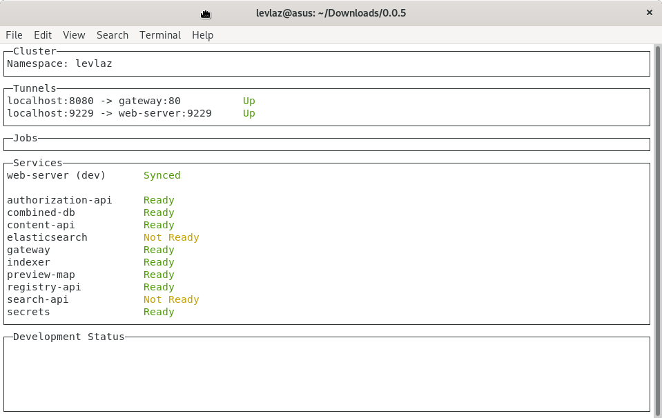
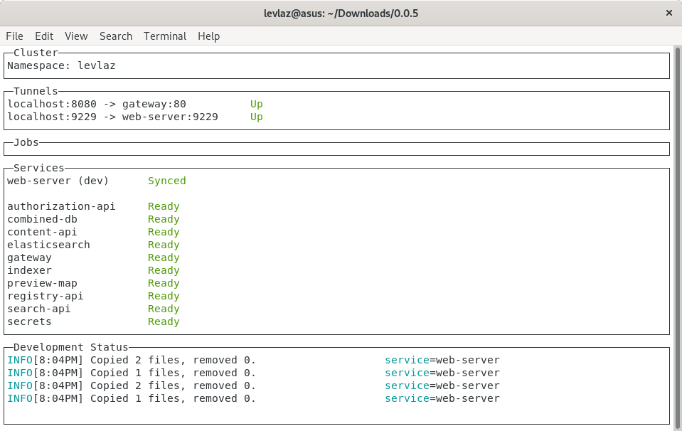

# Quickstart

This guide will quickly get you up and running with Kelda. We will be working
with a real-world, open source, microservices application called [Magda](https://github.com/magda-io/magda).
We will deploy Kelda to a Kubernetes cluster,  install the CLI, deploy a
development instance of Magda, fix a bug, and see our local changes take effect
immediately on the development server. After reading this guide  you will have
a solid foundation on the basics of how to deploy, install, and  use Kelda to
supercharge your microservices development workflow. Let's jump in.

## Dependencies

This guide assumes that you have:

- Installed [`kubectl`](https://kubernetes.io/docs/tasks/tools/install-kubectl/).
- Downloaded your Kelda license. This should have been emailed to you by the
  Kelda team.

## Setup

1. **Create a Kubernetes cluster, and add it to your [kubeconfig](https://kubernetes.io/docs/concepts/configuration/organize-cluster-access-kubeconfig/) file**

    **Note:** We recommend a cluster with at least 4CPUs and 8GB of RAM.

    If someone else has already created the Kubernetes cluster that
    you want to use with Kelda, add that cluster to your kubeconfig.

1. **Install the latest Kelda release**

    Paste the following into your shell to download the latest Kelda release:

        curl -fsSL https://kelda.io/install.sh | sh

    You should see the following output:

        Downloading the latest Kelda release...
        ################################################################# 100.0%
        The latest Kelda release has been downloaded to /var/folders/8j/wk3ln0fj1nd4sb4pn1bz7j9m0000gn/T/tmp.ZftQtS2I/kelda
        Please install Kelda to your desired location, or use the snippet below to install it to /usr/local/bin.

            sudo cp /var/folders/8j/wk3ln0fj1nd4sb4pn1bz7j9m0000gn/T/tmp.ZftQtS2I/kelda /usr/local/bin

    Either use the provided snippet to upgrade if Kelda is installed in
     `/usr/local/bin`, otherwise copy the binary over to your install location.

1. **Download the Magda example project**

    Use the following commands to download the Magda example project:

        curl -Lo magda-demo.tar.gz https://update.kelda.io/?file=demo&release=latest&token=install

        tar -xvzf magda-demo.tar.gz

        cd magda

    The rest of this guide assumes you are running commands from the root of the
    `magda` folder.

1. **Deploy the Kelda minion**

    **Note:** Only the first person that sets up
    the cluster needs to run this step.

    ??? note "Google Kubernetes Engine (GKE) Users Must Run an Extra Step"
        If you are running on GKE, you'll need to grant yourself
        cluster admin access before deploying Kelda. You can grant this access
        by running the command shown below. Be sure to replace `<GKE_USERNAME>` with
        the Google account that you want to grant admin access to, e.g. "name@company.io".

            kubectl create clusterrolebinding admin --clusterrole=cluster-admin --user=<GKE_USERNAME>

    Execute the deployment by running the following command.

        kelda setup-minion --license <path to license>

    This command will deploy the Kelda minion to your Kubernetes cluster.
    If this step succeeds, you should see something like this in the output:

        Deploy to context `dev`? (y/N) y
        Deploying Kelda components to the `dev` context....
        Waiting for minion to boot....
        Done!

1. **Deploy the registry credential for Magda**

    **Note:** Only the first person that sets up
    the cluster needs to run this step.

    The following command deploys the registry credential used for pulling
    the Magda private images.

        kubectl apply -f ./magda-kelda-config/setup

    The output will look something like:

        secret/regcred created

1. **Create the Kelda configuration file**

        cd magda-kelda-config
        kelda config

    The `config` command is used to set up a user-specific configuration for
    Kelda. Running this command will ask you a couple of questions.

        Unique identifier for development namespace [<user>]:

    The *unique identifier* defaults to the username of the user that executed
    the `config` command. You can change this to any string if you wish, but it
    should be unique to the Kubernetes cluster.

        Kubernetes context for development cluster [gke_user-240619_us-central1-a_kelda]:

    The *Kubernetes context* refers to the `kubectl` context that you wish to use
    with this cluster. This will default to the current `kubectl` context. You
    can change this to any other valid context if you wish.

        Path to Kelda Workspace file [/home/<user>/0.9.0/magda-kelda-config/workspace.yaml]:

    The *Kelda Workspace* file refers to the Kelda configuration that you wish to
    use for this cluster. It will default to the `workspace.yaml` file that
    it locates in the current directory.

    After completing these configuration prompts, a Kelda configuration file
    will be written to your home directory.

        Wrote config to /home/<user>/.kelda.yaml

1. **Start Kelda**

        cd ..
        kelda dev ./magda-web-server

    `kelda dev` will deploy the Magda service to the remote cluster and boot
    all application dependencies. You will see a new screen in  your terminal
    with information about the cluster.

    

    Wait for all the services to become `Ready`. The first boot may take several
    minutes because the Docker images need to be pulled.

1. **View the Bug**

    Navigate to `localhost:8080` in your browser. You should see a website with a
    search box. Try searching for any string — you should notice a red error
    message pop up on the bottom right portion of the screen complaining about
    a SyntaxError in JSON.

1. **Fix the SyntaxError bug**

    Fix this bug by editing your local copy of `magda-web-server/src/index.js`,
    and replacing `this_value_is_wrong` with `v0` on line 104.

    You will notice that Kelda will automatically sync your change and restart
    the affected containers. The **Development Status** portion of the Kelda
    terminal application informs you of all of the changes that are occurring
    in real time.

    

    If you refresh the page in your browser, or perform a new search, you should
    see the `SyntaxError` go away, and search results begin to appear.

## Debugging

1. **View service logs**

    `kelda logs` allows you to inspect the logs of any running service in your
    cluster.

    In your terminal, type in `kelda logs gateway` to inspect all of the
    requests that have been made to your `gateway` service since you began
    this quickstart guide.

1. **SSH into a service**

    `kelda ssh` allows you to remotely access any service in your cluster.

    In your terminal, type in `kelda ssh gateway`. This will place you into a
    root shell on the gateway service container running inside of your Kubernetes
    cluster. Type in `ps aux` to see all of the currently running processes inside
    the gateway service container. The output should look something like this:

        kelda ssh gateway

        # ps aux
        USER         PID %CPU %MEM    VSZ   RSS TTY      STAT START   TIME COMMAND
        root           1  0.2  0.7 1220256 57016 ?       Ssl  18:52   0:03 node /usr/src
        root          22  0.0  0.0   4344   776 ?        Ss   19:13   0:00 sh
        root          30  0.0  0.0  17512  2080 ?        R+   19:14   0:00 ps aux

## Cleanup

1. **Exit Kelda**

    You can exit Kelda by entering `Ctrl + c` into the terminal window where
    the Kelda CLI is running.

Congratulations! You've now seen how easy it is to use Kelda to make changes
to your code base locally and instantly see them reflected in a Kubernetes
cluster. You can keep exploring with this sample application, or move on to
the rest of our documentation to learn how to start using Kelda with your
own application.
