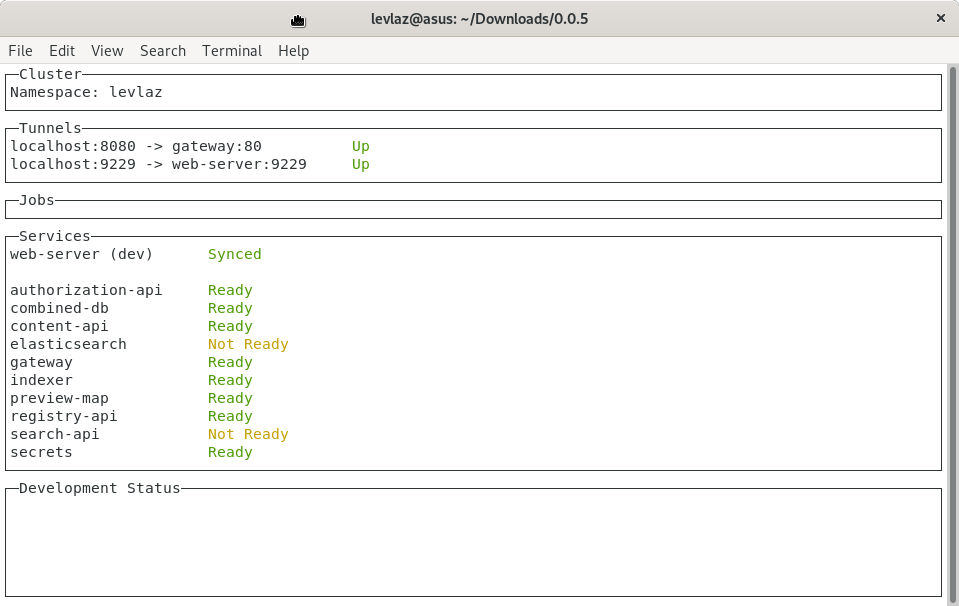
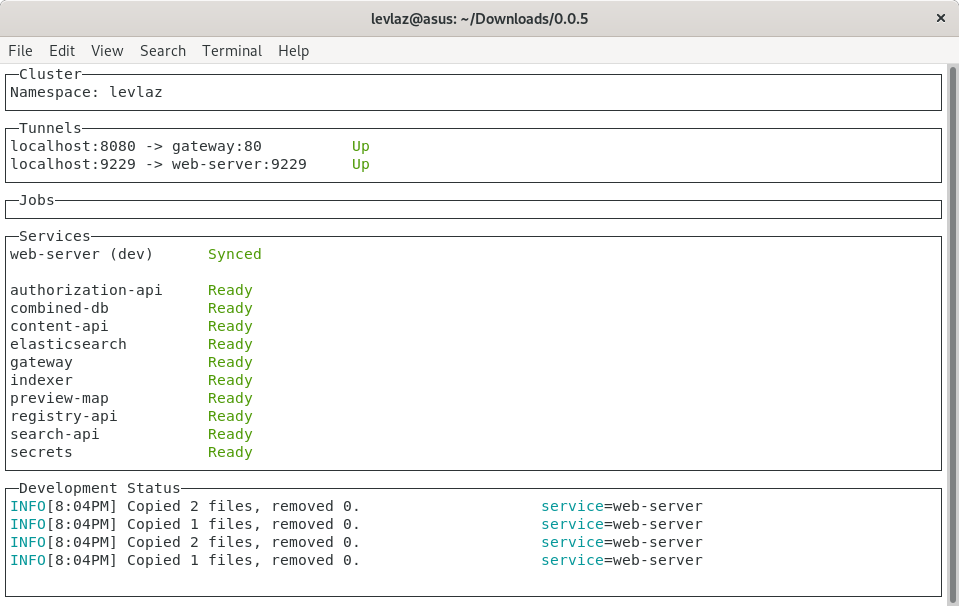

# Getting Started

This guide will quickly get you up and running with Kelda. We will be working with a real-world, open source, microservices application called [Magda](https://github.com/magda-io/magda). We will deploy Kelda to a Kubernetes cluster, install the CLI, deploy a development instance of Magda, fix a bug, and see our local changes take effect immediately on the development server. After reading this guide you will have a solid foundation on the basics of how to deploy, install, and use Kelda to supercharge your microservices development workflow. Let's jump in.

## Dependencies

This guide assumes that you have:

* Installed [`kubectl`](https://kubernetes.io/docs/tasks/tools/install-kubectl/).
* Downloaded your Kelda license. This should have been emailed to you by the

  Kelda team.

## Setup

1. **Create a Kubernetes cluster, and add it to your** [**kubeconfig**](https://kubernetes.io/docs/concepts/configuration/organize-cluster-access-kubeconfig/) **file**

   **Note:** We recommend a cluster with at least 4CPUs and 8GB of RAM.

   If someone else has already created the Kubernetes cluster that you want to use with Kelda, add that cluster to your kubeconfig.

2. **Install the latest Kelda release**

   Paste the following into your shell to download the latest Kelda release:

   ```text
    curl -fsSL https://kelda.io/install.sh | sh
   ```

   You should see the following output:

   ```text
    Downloading the latest Kelda release...
    ################################################################# 100.0%
    The latest Kelda release has been downloaded to /var/folders/8j/wk3ln0fj1nd4sb4pn1bz7j9m0000gn/T/tmp.ZftQtS2I/kelda
    Please install Kelda to your desired location, or use the snippet below to install it to /usr/local/bin.
   ```

```text
        sudo cp /var/folders/8j/wk3ln0fj1nd4sb4pn1bz7j9m0000gn/T/tmp.ZftQtS2I/kelda /usr/local/bin


Either use the provided snippet to upgrade if Kelda is installed in
 `/usr/local/bin`, otherwise copy the binary over to your install location.
```

1. **Download the Magda example project**

   Use the following commands to download the Magda example project:

   ```text
    curl -Lo magda-demo.tar.gz https://update.kelda.io/?file=demo&release=latest&token=install

    tar -xvzf magda-demo.tar.gz

    cd magda
   ```

   The rest of this guide assumes you are running commands from the root of the `magda` folder.

2. **Deploy the Kelda minion**

   **Note:** Only the first person that sets up the cluster needs to run this step.

   ??? note "Google Kubernetes Engine \(GKE\) Users Must Run an Extra Step" If you are running on GKE, you'll need to grant yourself cluster admin access before deploying Kelda. You can grant this access by running the command shown below. Be sure to replace `<GKE_USERNAME>` with the Google account that you want to grant admin access to, e.g. "name@company.io".

   ```text
        kubectl create clusterrolebinding admin --clusterrole=cluster-admin --user=<GKE_USERNAME>
   ```

   Execute the deployment by running the following command.

   ```text
    kelda setup-minion --license <path to license>
   ```

   This command will deploy the Kelda minion to your Kubernetes cluster. If this step succeeds, you should see something like this in the output:

   ```text
    Deploy to context `dev`? (y/N) y
    Deploying Kelda components to the `dev` context....
    Waiting for minion to boot....
    Done!
   ```

3. **Deploy the registry credential for Magda**

   **Note:** Only the first person that sets up the cluster needs to run this step.

   The following command deploys the registry credential used for pulling the Magda private images.

   ```text
    kubectl apply -f ./magda-kelda-config/setup
   ```

   The output will look something like:

   ```text
    secret/regcred created
   ```

4. **Create the Kelda configuration file**

   ```text
    cd magda-kelda-config
    kelda config
   ```

   The `config` command is used to set up a user-specific configuration for Kelda. Running this command will ask you a couple of questions.

   ```text
    Unique identifier for development namespace [<user>]:
   ```

   The _unique identifier_ defaults to the username of the user that executed the `config` command. You can change this to any string if you wish, but it should be unique to the Kubernetes cluster.

   ```text
    Kubernetes context for development cluster [gke_user-240619_us-central1-a_kelda]:
   ```

   The _Kubernetes context_ refers to the `kubectl` context that you wish to use with this cluster. This will default to the current `kubectl` context. You can change this to any other valid context if you wish.

   ```text
    Path to Kelda Workspace file [/home/<user>/0.9.0/magda-kelda-config/workspace.yaml]:
   ```

   The _Kelda Workspace_ file refers to the Kelda configuration that you wish to use for this cluster. It will default to the `workspace.yaml` file that it locates in the current directory.

   After completing these configuration prompts, a Kelda configuration file will be written to your home directory.

   ```text
    Wrote config to /home/<user>/.kelda.yaml
   ```

5. **Start Kelda**

   ```text
    cd ..
    kelda dev ./magda-web-server
   ```

   `kelda dev` will deploy the Magda service to the remote cluster and boot all application dependencies. You will see a new screen in your terminal with information about the cluster.

   

   Wait for all the services to become `Ready`. The first boot may take several minutes because the Docker images need to be pulled.

6. **View the Bug**

   Navigate to `localhost:8080` in your browser. You should see a website with a search box. Try searching for any string — you should notice a red error message pop up on the bottom right portion of the screen complaining about a SyntaxError in JSON.

7. **Fix the SyntaxError bug**

   Fix this bug by editing your local copy of `magda-web-server/src/index.js`, and replacing `this_value_is_wrong` with `v0` on line 104.

   You will notice that Kelda will automatically sync your change and restart the affected containers. The **Development Status** portion of the Kelda terminal application informs you of all of the changes that are occurring in real time.

   

   If you refresh the page in your browser, or perform a new search, you should see the `SyntaxError` go away, and search results begin to appear.

## Debugging

1. **View service logs**

   `kelda logs` allows you to inspect the logs of any running service in your cluster.

   In your terminal, type in `kelda logs gateway` to inspect all of the requests that have been made to your `gateway` service since you began this quickstart guide.

2. **SSH into a service**

   `kelda ssh` allows you to remotely access any service in your cluster.

   In your terminal, type in `kelda ssh gateway`. This will place you into a root shell on the gateway service container running inside of your Kubernetes cluster. Type in `ps aux` to see all of the currently running processes inside the gateway service container. The output should look something like this:

   ```text
    kelda ssh gateway

    # ps aux
    USER         PID %CPU %MEM    VSZ   RSS TTY      STAT START   TIME COMMAND
    root           1  0.2  0.7 1220256 57016 ?       Ssl  18:52   0:03 node /usr/src
    root          22  0.0  0.0   4344   776 ?        Ss   19:13   0:00 sh
    root          30  0.0  0.0  17512  2080 ?        R+   19:14   0:00 ps aux
   ```

## Cleanup

1. **Exit Kelda**

   You can exit Kelda by entering `Ctrl + c` into the terminal window where the Kelda CLI is running.

Congratulations! You've now seen how easy it is to use Kelda to make changes to your code base locally and instantly see them reflected in a Kubernetes cluster. You can keep exploring with this sample application, or move on to the rest of our documentation to learn how to start using Kelda with your own application.

